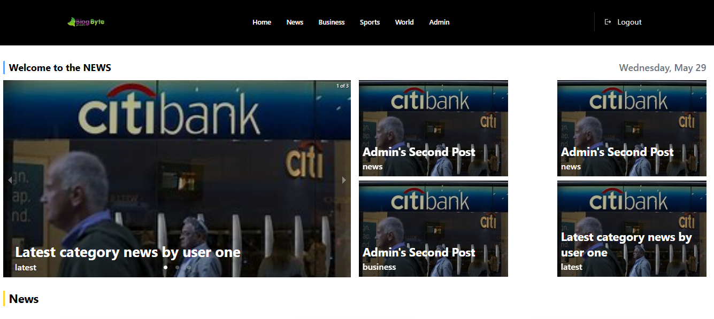
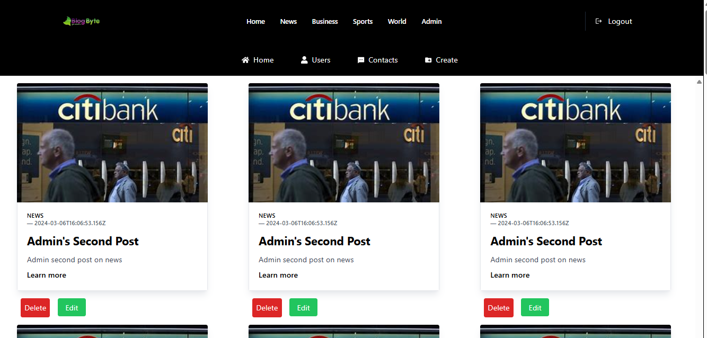
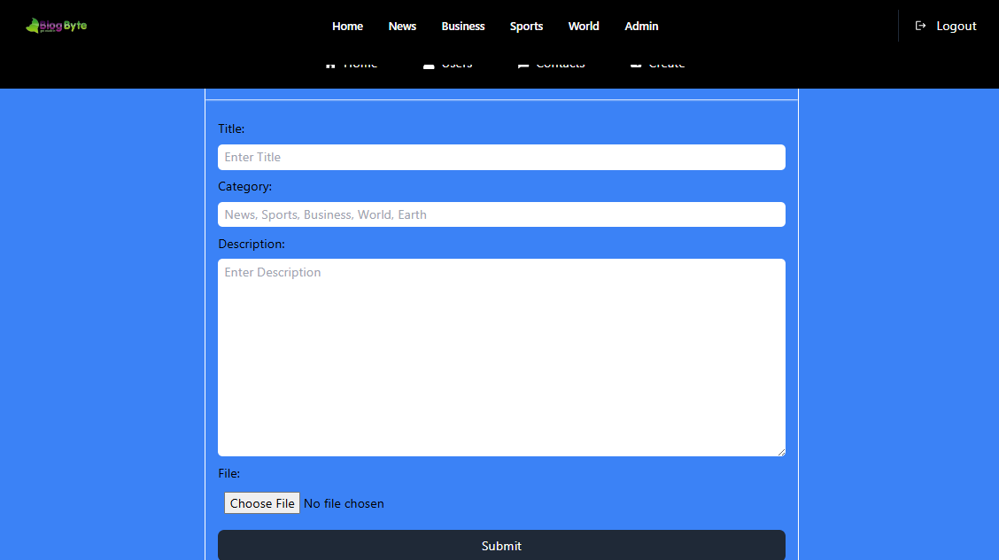
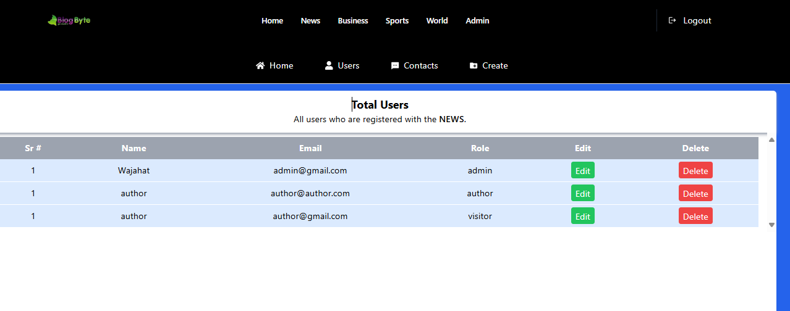
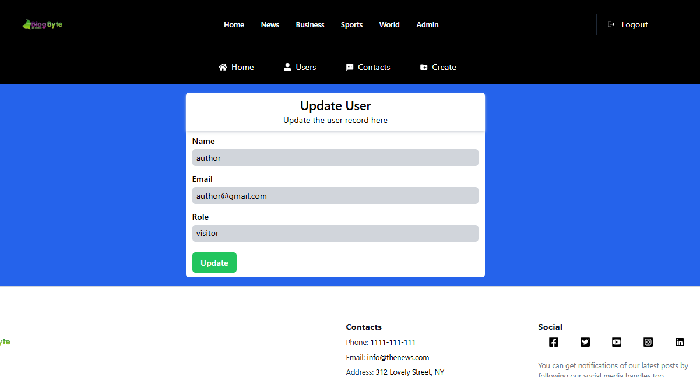
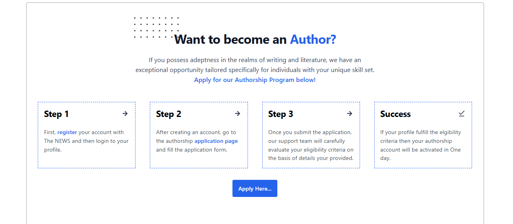
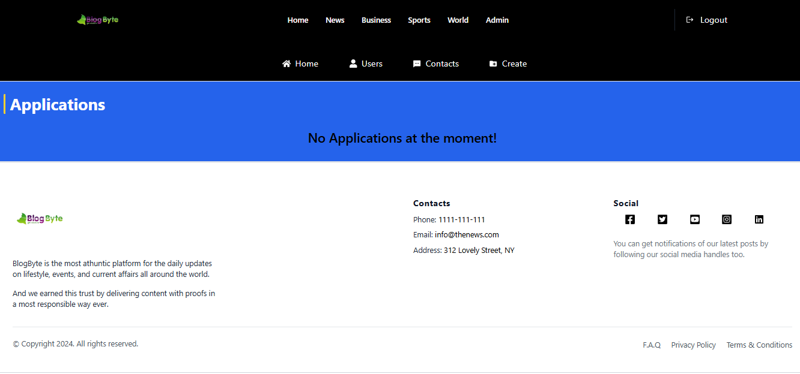

# Blogging Web Application

## 📖 Table of Contents

- [Introduction](#introduction)
- [Features](#features)
- [Technologies Used](#technologies-used)
- [Installation](#installation)
- [Usage](#usage)
- [Project Structure](#project-structure)
- [Contributing](#contributing)
- [Contact](#contact)
- [Screenshots](#screenshots)

## 📃 Introduction

This is a blogging web application built using the MERN stack (MongoDB, Express, React, Node.js). It allows users to read blogs created by other users, as well as create and manage their own blogs.

## 💡 Features

- User authentication and authorization
- Create, read, update, and delete (CRUD) blog posts
- Responsive design for mobile and desktop
- User can join as a reader, but can also apply to become an author, for more upgraded features like creating blogs and accessing other perks.

## ⚙️ Technologies Used

- **Frontend**: React, Context API, React Router, Axios
- **Backend**: Node.js, Express.js
- **Database**: MongoDB, Mongoose
- **Authentication**: JSON Web Tokens (JWT), bcrypt
- **Styling**: CSS, TailwindCSS
- **Development Tools**: Nodemon, Webpack

## 📩 Installation

To run this project locally, follow these steps:

1. **Clone the repository**:
    ```bash
    git clone https://github.com/wajaht-ali/mern-blog-app.git
    cd mern-blog-app
    ```

2. **Install dependencies**:
    ```bash
    # Install server dependencies
    cd server
    npm install

    # Install client dependencies
    cd ../client
    npm install
    ```

3. **Set up environment variables**:
    Create a `.env` file in the `server` directory and add the following:
    ```env
    PORT=8000
    MONGODB_URI=your_mongodb_uri
    JWT_SECRET=your_jwt_secret
    ```

4. **Run the application**:
    ```bash
    # Run server
    cd server
    npm start OR nodemon

    # Run client
    cd ../client
    npm start
    ```

## 🔦 Usage

Once the application is running, open your browser and navigate to `http://localhost:8000` to start using the blog application.

## 🗃️ Project Structure

```plaintext
.
├── client
│   ├── public
│   └── src
│       ├── components
│       ├── pages   
│       ├── App.js
│       └── index.js
├── server
│   ├── config
│   ├── controllers
│   ├── models
│   ├── routes
│   ├── middleware
│   └── server.js
└── README.md
```

## ➕ Contributing
Contributions are welcome! Please fork the repository and create a pull request with your changes.

- Fork the repository
- Create a new branch (git checkout -b feature-branch)
- Commit your changes (git commit -am 'Add new feature')
- Push to the branch (git push origin feature-branch)
- Create a new Pull Request


## 📷 Screenshots
- Home Page


- Admin Home Page


- Create Post 


- All Users


- Update User


- Authorship Application form


- Admin's Applications Inbox



## 📨 Contact
If you have any questions or suggestions, feel free to contact me at contact.chwajahat@gmail.com.
